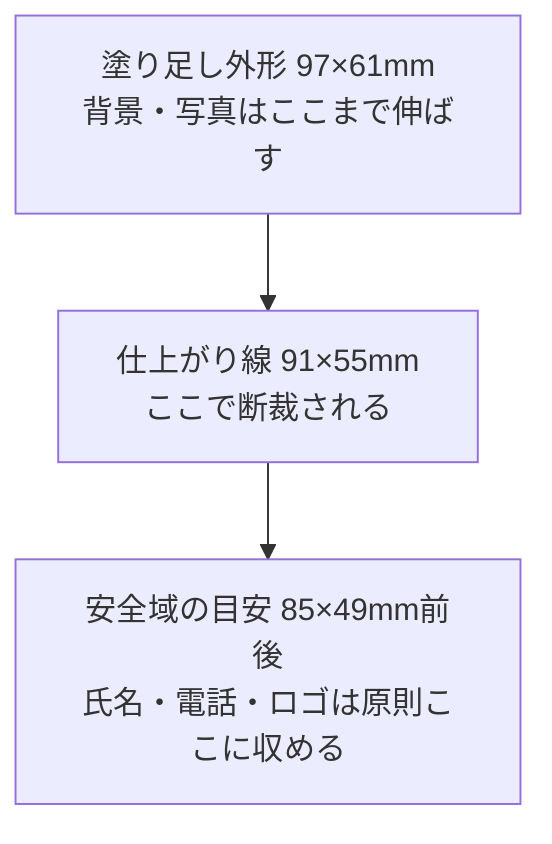

[deep-research-report_namecard.md](https://github.com/user-attachments/files/30072443/deep-research-report_namecard.md)
# 名刺制作におけるタブーと基本ルール

## エグゼクティブサマリー

一般的なビジネス名刺で失敗しやすいのは、奇抜さそのものではなく、**断裁・余白・可読性・権利処理**を軽視することです。実務で最も多い事故は、端に寄せすぎた文字やロゴが裁ちで危険になること、情報を詰め込みすぎて優先順位が崩れること、細すぎる文字や低コントラスト配色で読みにくくなること、そしてWeb用の低解像度画像やRGB色、未許諾ロゴをそのまま印刷に流用することです。主要印刷会社のガイドは、塗り足し・安全域・CMYK・解像度・オーバープリント確認を一貫して重視しており、アクセシビリティの観点ではJIS X 8341-3とWCAGのコントラスト原則、CUDOの色覚多様性配慮が実務的なチェック基準になります。citeturn13view1turn17search2turn17search5turn13view2turn13view3turn12search9turn2search3turn24view0turn24view1

一般ビジネス名刺の安全な初期設定は、**仕上がり91×55mm、塗り足し上下左右3mm、重要情報は仕上がり内側3〜5mm、氏名10〜16pt、連絡先8pt以上、書体は多くても2系統、写真は実寸で300〜350dpi、ロゴはベクター、細い黒文字はK100のみ**です。これだけで、視認性・印刷再現・ブランド整合の失敗率は大きく下がります。なお、日本の標準サイズは91×55mmが広く使われ、欧米サイズは89×51mm前後です。citeturn30search1turn30search2turn30search8turn13view1turn17search7turn20search0turn20search1turn20search4turn31view0turn17search10turn13view2turn21search1turn17search0

法務面では、**他社ロゴ・写真・イラストの無断使用、著作者に無断でのトリミングや色変更、名刺交換で得た個人情報の雑な共有や転用**が大きなリスクです。特許庁は先行商標調査の重要性を明記しており、文化庁は無断使用や無断改変が著作権・著作者人格権の問題になることを示しています。個人情報保護委員会は、業務で整理・利用される名刺情報が企業の個人情報データベース等に該当し得ること、広告宣伝メールには個人情報保護法以外の関連法令も関わることを示しています。citeturn1search11turn9search4turn33search2turn15view0turn13view5

## 標準仕様とサイズ設計の基本

日本の一般的なビジネス名刺は**91×55mm**が標準で、印刷会社各社もこのサイズを基準にテンプレートや商品を設計しています。標準外サイズはブランディング上の差別化には使えますが、名刺入れ・ホルダー・管理ファイルとの相性が悪くなるため、一般用途では「まず標準サイズを守る」が安全です。特に保守的な業界や日本国内の初対面営業では、変形サイズや極端な小型サイズは、創造性より先に「遊びが強い」「管理しづらい」という印象を与えることがあります。citeturn30search0turn30search1turn30search8turn27search15

断裁設計では、**塗り足し・トリム・安全域**を混同しないことが最重要です。主要印刷ガイドでは、背景や写真など端まで届く要素は仕上がりより外側へ**3mm**の塗り足しを確保し、文字やロゴなど切れて困る要素は仕上がり位置から**3mm以上内側**に置くことを推奨しています。バンフーは断裁時に2mm未満のズレが許容範囲として起こり得ると説明しており、Web編集テンプレートでは見た目の安全のため**5mm程度内側**を勧めています。つまり、実務では「**最低3mm、できれば3〜5mm**」が安全域の考え方です。citeturn13view1turn17search7turn17search16turn31view0

このモデルを前提にすると、**避けるべきタブー**はかなり明確です。もっとも危険なのは、端から1〜2mmに電話番号やメールアドレスを置くこと、フチいっぱいに細い罫線の枠を回すこと、背景画像を仕上がりサイズぴったりで作ることです。これらは少しの断裁ズレでも「切れ」「白フチ」「左右非対称」を生み、完成品が安っぽく見える典型原因になります。citeturn13view1turn17search2turn17search10

| 項目 | 推奨の基準 | タブー | 主な理由 |
|---|---|---|---|
| 仕上がりサイズ | 一般用途は91×55mm | 初対面営業で極端な変形サイズ | 管理しづらさ、保守的業界での違和感 |
| 塗り足し | 各辺3mmを基本 | 背景を仕上がり線で止める | 白フチ発生 |
| 安全域 | 仕上がりから内側3〜5mm | 端ギリギリに氏名・電話・ロゴ | 断裁ズレで欠ける |
| 枠線 | 太めか、十分な余白を取る | 細い外周枠を断裁近くに置く | わずかなズレで歪みが目立つ |
| 両面の向き | 表裏で異方向ならめくり方向を統一 | 縦横混在で回転方向が曖昧 | 受け手が読み替えに迷う |

表の数値基準は、日本の主要印刷ガイドとテンプレートの説明に基づく実務値です。印刷所によりテンプレートが異なるため、最終的には**発注先テンプレートの数値を優先**してください。citeturn13view1turn31view0turn30search1turn17search16

## 配置と視覚的ヒエラルキーのタブー

名刺の配置設計で最も重要なのは、**「何を最初に読ませるか」を一目で決めること**です。一般的なビジネス名刺では、受け手が最初に知りたいのは通常、**氏名、会社名、肩書、連絡先**であり、そこにブランド認知用のロゴが加わります。ロゴを主役にするか、氏名を主役にするかはブランド戦略次第ですが、どちらにしても「全要素が同じ強さ」に見える設計は失敗です。VistaprintやAdobeのガイドも、必要情報を整理し、レイアウトで優先度を明確にすることを繰り返し勧めています。citeturn28search13turn28search12turn28search0turn28search7

ここでの代表的なタブーは、**情報の同列化、中央揃えの乱用、詰め込み、装飾優先**です。氏名・役職・会社名・URL・住所・SNS・キャッチコピー・QRコードがすべて同じサイズ・同じウェイト・同じ濃度で並ぶと、受け手は「どれが核心情報なのか」を瞬時に判断できません。名刺は小さな紙面なので、情報の過不足は単なる好みではなく、**記憶保持率と行動率**に直結します。citeturn28search7turn28search1turn20search9

実務上は、**表面に本人識別、裏面に補足情報**という分け方が堅実です。表面には氏名、会社名、肩書、主要連絡先を置き、裏面には英語表記、事業説明、所在地、QRコード、サービス領域などを整理すると、表の視認性を壊さずに情報量を増やせます。特に海外対応では、裏面を現地語または英語面にする構成が有効です。中国・台湾・韓国では bilingual card が推奨されており、日本でも外国人向けには日本語と英語の両面運用が合理的です。citeturn26search1turn26search8turn26search12turn26search0

| 設計テーマ | 良い設計 | 悪い設計 | なぜ差が出るか |
|---|---|---|---|
| 優先順位 | 氏名を最大、会社名と肩書を次点、連絡先を整理して下段へ | すべて同サイズ・同ウェイト | 視線誘導が起こらない |
| 揃え | 左揃えか中央揃えを一貫 | 氏名だけ中央、連絡先は右、住所は左で混在 | 整列感が崩れ、雑然と見える |
| 情報量 | 表は主要情報、裏で補足 | 1面に全情報を詰め込む | 読み飛ばしが増える |
| QRコード | 補助導線として配置し、周囲に余白を確保 | QRコードを主役級に巨大化 | 接点説明より機械記号が前面化する |
| 余白 | 外周とグループ間に呼吸を作る | 文字ブロックが詰まり、端にも寄る | 圧迫感・可読性低下 |

この表の「良い設計」は、名刺を**一秒で理解できる紙面**として扱う発想に基づいています。逆に「悪い設計」は、名刺をパンフレットやプロフィールシートのように扱っている点が問題です。名刺の役割はすべてを説明することではなく、**相手が後から迷わず連絡できること**です。citeturn28search0turn28search1turn28search7turn28search12

## フォントと色彩のタブー

フォント設計では、「どの書体名を選ぶか」よりも、**小サイズ印刷でも字形差が保たれるか**が重要です。モリサワはUDフォントを「より多くの人に読みやすいフォント」と位置づけ、第三者機関と可読性研究を行っています。可読性研究では、40cmの読書距離で**8pt以上**の印刷物は「読みにくさを感じさせない」とされ、主要印刷サービスも概ね**本文級情報は8pt以上、7ptは下限**としています。氏名は10〜16pt程度が一般的で、主要情報の可読性を確保するには、細すぎるウェイトや圧縮書体を避ける必要があります。citeturn2search0turn8search5turn20search0turn20search1turn20search2turn20search4

したがって、名刺における「禁忌フォント」は特定のフォント名というより、**小サイズで字形差が壊れる条件**です。具体的には、極細ウェイト、強い長体・平体、手書き風スクリプト、装飾明朝、可読性の低い筆文字、I/l/1やO/0の区別が弱い欧文、電話番号やメールアドレスに使う極端なコンデンス体は避けるべきです。逆に、和文なら可読性重視の明朝・ゴシック・UD系、欧文なら Helvetica、Arial、Verdana などの読みやすいファミリーが安全です。これは「保守的だから」ではなく、**名刺は読めなければ機能しない**からです。citeturn20search5turn20search9turn20search15turn20search10

行間は名刺では軽視されがちですが、肩書・部署名・住所・英字URLの読みやすさに直結します。一般論として、読みやすい印刷組版では**1.2〜1.5倍程度の行間**が目安とされます。名刺では紙面が小さいため、実務上は**1.2〜1.4倍を起点に、住所段落だけ少し広げる**やり方が使いやすいです。これは厳密な規格値ではなく、可読性原則に基づく実務推奨です。行間を詰めすぎると、高齢者・近見が苦手な読者・英数字が多い連絡先で読み間違いが増えます。citeturn20search10turn4search3turn2search8

色彩では、**低コントラストと色依存**が二大タブーです。CUDOは「できるだけ多くの人に見分けやすい配色」「色が見分けにくい場合でも情報が伝わること」を重視し、推奨配色セットにはRGB・CMYK指定値まで用意しています。JIS X 8341-3:2016はWCAG 2.0と一致しており、4.5:1のコントラスト比は印刷物にそのまま法的適用されるわけではありませんが、**名刺の前景・背景コントラストを評価する実務的な下限の目安**として非常に有効です。赤と緑だけで部署や役割を区別する、淡いグレー文字を白地に乗せる、写真の上に白抜き小文字を載せる、といった設計は避けるべきです。citeturn24view0turn24view1turn12search0turn12search9turn2search3turn4search3

印刷色の扱いでも注意が必要です。印刷会社は、**CMYKでの入稿**を基本とし、RGBから後変換すると色がくすむ可能性を警告しています。特色（スポットカラー）は、通常のCMYK印刷商品では正しく再現されないことがあり、最終的にCMYKへ変換するよう求めるガイドもあります。また、黒の扱いを誤って**リッチブラックを細い文字や白抜き文字に使う**と、見当ズレで滲み・潰れが起きやすくなります。細い文字や線は原則K100で作るのが安全です。citeturn10search14turn10search1turn10search5turn13view2turn10search2turn21search1

| テーマ | 安全な基準 | タブー | 主な理由 |
|---|---|---|---|
| 文字サイズ | 連絡先8pt以上、氏名10〜16pt | 連絡先6pt台を常用 | 小サイズ印刷で読めない |
| 書体数 | 1〜2ファミリー | 3〜4書体を混在 | 統一感が壊れる |
| 書体条件 | 字形差の明確な可読書体 | 極細・筆記体・強い長体 | 誤読と印象低下 |
| 行間 | 1.2〜1.4倍を起点 | ベタ組みに近い詰め組み | 圧迫感、視線迷子 |
| コントラスト | 強い明度差を確保 | 薄灰×白、白抜き小文字、写真上の細字 | 判読性低下 |
| 色の意味づけ | 色＋位置・文字・アイコンで冗長化 | 赤と緑だけで区別 | 色覚多様性への非対応 |
| 黒の指定 | 細字はK100 | 細字にリッチブラック | 見当ズレで滲む |

表のサイズ値や印刷上の注意点は印刷会社ガイド、可読性研究、WCAG/JISおよびCUDOの原則に基づきます。citeturn8search5turn20search0turn20search1turn20search4turn24view0turn24view1turn12search9turn13view2

## 画像とロゴ、法務、印刷工程のタブー

画像とロゴで最も多いタブーは、**Web用素材を印刷に流用すること**です。バンフーは72dpi画像では印刷品質を満たさないと明記し、Web編集では350dpi以上を推奨しています。CanvaやMOOも、印刷では少なくとも300dpiを推奨しています。したがって、名刺では**写真は実寸で300〜350dpi、ロゴは可能な限りベクター**が原則です。Webサイトから拾ったロゴPNGやSNSアイコン画像をそのまま置くのは、画質面でも権利面でも危険です。citeturn13view3turn31view0turn17search5turn17search10turn20search8turn11search13

トリミングでも注意が必要です。文化庁は、サイズ変更、色調変更、縦横比変更、一部切除などが著作者人格権の問題を生じさせる可能性を示しています。つまり、ストック写真や外部制作ロゴを「少し切る」「色をブランド色に変える」「縦横比を詰める」といった処理は、見た目の問題だけでなく**契約・著作権・人格権の問題**になります。特に人物写真は、肖像・プライバシー配慮も必要です。自社スタッフの顔写真を載せる場合でも、掲載目的・媒体・更新管理を明確にしておくべきです。citeturn33search2turn9search4turn33search5

透過や保存形式も軽視できません。Adobeは、透明表現を含むアートワークは出力環境によってフラット化が必要になることがあると説明しており、MOOも「透明をフラット化し、オーバープリントを切る」ことを推奨しています。PNGはWeb向きで、印刷でそのまま推奨されない場合があるという印刷会社ガイドもあります。安全策は、**入稿仕様に従ってPDF/X系または印刷会社指定PDFで書き出し、透明効果・オーバープリント・フォント埋め込み／アウトラインを事前確認すること**です。citeturn11search0turn11search12turn21search1turn11search3turn21search4turn21search14

ブランド一貫性の面では、名刺だけ別人格になるのが典型的な失敗です。Googleはロゴの clear space を確保し、自社ロゴと組み合わせて改変しないこと、背景コントラストを確保することを求めています。Microsoft 365 の商標ガイドも、ロゴ周囲の clear space、未承認色やシャドウ追加の禁止、不十分な背景コントラストの禁止を明記しています。つまり、名刺制作で避けるべきタブーは、**ロゴを勝手に詰める・伸ばす・色替えする・低コントラスト背景へ置く**ことです。自社ブランドでも同様のルールを作っておかないと、部署ごとに別ブランド化が起こります。citeturn13view6turn13view7turn4search5

法務面では、商標と個人情報も見逃せません。特許庁は、出願前に**先行商標調査**を行う重要性を示し、他人の登録商標や著名商標と紛らわしい商標は問題になり得るとしています。個人情報保護委員会は、業務用途で整理された名刺情報が企業の個人情報データベース等に該当し得ること、名刺交換後の広告宣伝には関係法令の遵守が必要であることを示しています。名刺そのものに機密情報まで載せる必要はなく、**個人直通携帯・個人メール・顔写真・私用SNS**は運用目的が明確なときだけ載せるのが安全です。citeturn1search11turn1search8turn13view5turn15view0

印刷工程では、**オーバープリント、リッチブラック、紙質と加工の不一致**が実務上の事故源です。白オーバープリントは「画面では見えるのに印刷では消える」典型事故で、黒オーバープリントは背面色の透けにつながります。紙質は発色と印象を大きく変えます。コート紙は発色重視、マットコート紙は反射を抑えた上品さ、上質紙は堅実・筆記適性が強みです。特殊紙や箔押しは魅力的ですが、過剰に使うと文字の視認性を落とし、加工指示データも増えます。MOOは特殊仕上げ面積を50%未満に抑えるよう勧めており、ラクスルも箔押しで専用データが必要だと案内しています。citeturn23view2turn32view1turn32view0turn32view2turn17search3turn3search4

| 項目 | 避けるべきタブー | 理由 | 安全策 |
|---|---|---|---|
| 解像度 | WebロゴPNG・72dpi画像の流用 | 粗れ・ぼけ | 写真300〜350dpi、ロゴはベクター |
| トリミング | 顔やロゴを安全域ぎりぎりで切る | 断裁事故、人格権・契約問題 | 安全域内に収め、権利条件を確認 |
| 透過 | 透明効果や白抜きを未確認のまま入稿 | 消失・予期せぬ合成 | PDF出力とプレビュー確認 |
| フォント | 埋め込み/アウトライン未処理 | 置換・文字化け | 入稿前に埋め込みまたはアウトライン |
| 商標 | 他社ロゴ・名称を無断掲載 | 商標・ライセンス違反 | 使用許諾とガイドライン確認 |
| 個人情報 | 不要な直通情報を全員分掲載 | 漏えい・運用事故 | 掲載目的を定義し最小化 |
| 加工 | 箔・PP・特殊紙を盛り込みすぎる | 読みにくさ、コスト増、加工不整合 | 強調したい点に限定 |

この表のうち、商標・ロゴ運用は自社ブランドにもそのまま当てはまります。**ブランド一貫性は「ロゴの見た目」だけではなく、見せ方のルールを社内で統一すること**です。citeturn13view6turn13view7turn21search4turn21search14

## 業界別と文化的禁忌

業界別の禁忌は、「何が美しいか」ではなく、**その業界で信頼を壊しやすい表現は何か**で考えると整理しやすいです。金融・法務・士業・医療のような高信頼業界では、標準サイズ、控えめな配色、可読性の高い書体、広めの余白が有利です。Adobeは、金融・法務・ヘルスケアのような伝統的分野では標準サイズが向くと案内しており、Vistaprintも、ミニマルで整ったタイポグラフィは弁護士・コンサル・建築などで有効だと説明しています。逆に、極端な変形、派手な特殊紙、タイトルが読みにくい装飾書体は、「真面目さ」より「演出」が先に立ちやすいので避けるのが安全です。citeturn27search15turn27search0

一方、クリエイティブ、デザイン、美容、アパレル、スタートアップでは、独自性を打ち出す余地があります。ただし、ここでもタブーは残ります。**個性を出すこと**と**読めなくすること**は別であり、写真や特殊紙、角丸、色紙、箔押しを使っても、氏名・職能・連絡先が瞬時に取れなければ名刺として負けです。バンフーは、クリエイティブ系で特殊紙が人気だとしつつも、写真・イラスト向けには発色のよい紙を勧め、MOOやVistaprintも「特徴は一つか二つに絞る」方向を示しています。citeturn32view2turn19search10turn7search8

国・地域別では、**言語面と交換作法**が設計に跳ね返ります。日本向けなら、相手がすぐ読める向き・漢字表記・会社名の明瞭さが重要です。日本では名刺交換自体の儀礼性が高く、英語のみのカードは初対面の商談で不利になることがあります。Trade.govは、日本の初回訪問で通訳やバイリンガル補助者の存在を勧め、Gov.uk も日本での名刺交換をビジネスマナー上の重要事項として挙げています。citeturn26search0turn6search2

中国・台湾・韓国では、**現地語＋英語の両面名刺**が実務上かなり重要です。Trade.gov は、中国では中国語と英語の bilingual card を、台湾では繁体字と英語の両面名刺を、韓国では bilingual cards が最善だと案内しています。したがって、これらの市場に向けて英語だけの名刺を配ることは、内容以前に「準備不足」に見える可能性があります。役職名や会社名の翻訳も雑に直訳せず、現地で意味が通るか確認すべきです。citeturn26search1turn26search8turn26search12

東南アジアでは、名刺交換の所作が比較的重視される場面があります。マレーシアではカードを右手で扱うこと、タイでは相手の目の前で名刺に書き込みしないことが案内されています。これはデザインというより運用上の注意ですが、現地向けカードでは**受け手に向けた正方向の読みやすさ、肩書・会社・氏名が一面で完結すること**がより重要になります。日本でも、表裏で縦横が異なる場合のめくり方向を統一する運用は、こうした交換場面の読みやすさに関わります。citeturn25search13turn26search4turn31view0

| 文脈 | 避けたいデザイン・運用 | 背景 |
|---|---|---|
| 日本の一般商談 | 英語のみ、会社名が小さすぎる、縦横の向きが曖昧 | 名刺交換の儀礼性が高く、即読性が重要 |
| 士業・金融・医療 | 派手色、多加工、読みにくい肩書 | 信頼・堅実さが優先されやすい |
| クリエイティブ業界 | 個性を出すために可読性を犠牲にする | 個性は有効だが、連絡導線は必須 |
| 中国・台湾・韓国 | 英語だけ、直訳役職、日本語だけ | bilingual対応が実務的に有利 |
| タイ・マレーシア | 交換作法を無視した扱い | 受け渡し自体が関係構築の一部 |
| 北欧など比較的フラットな市場 | 名刺に情報を詰め込みすぎる | デジタル接続併用が一般化しつつある |

ここでの注意点は、「文化差があるから全部ローカライズすべき」ということではありません。**一般ルールは守りつつ、言語面と交換場面だけは相手市場に合わせる**のが費用対効果の高い対応です。citeturn26search3turn26search11turn26search20

## 実務チェックリストと良例悪例

以下は、一般的なビジネス名刺を制作・発注する前に使える**出稿前チェックリスト**です。印刷所テンプレートがある場合は、数値条件をテンプレート基準へ差し替えて運用してください。citeturn21search14turn17search12

| チェック項目 | 合格基準 |
|---|---|
| サイズ | 日本向け一般用途なら91×55mmを採用している |
| 塗り足し | 背景・写真が各辺3mm以上塗り足しまで伸びている |
| 安全域 | 氏名・電話・メール・ロゴが仕上がり内側3〜5mmに入っている |
| 優先順位 | 氏名が最初に読め、会社名・肩書・連絡先の順序が明確 |
| 文字 | 連絡先8pt以上、氏名10pt以上、極細や装飾体を避けている |
| 行間 | 住所・肩書が詰まりすぎていない |
| 色 | 低コントラスト、色だけの識別、蛍光風RGB色に依存していない |
| 黒 | 細字・細線はK100で作っている |
| 画像 | 写真は300〜350dpi、ロゴはベクターまたは十分な解像度 |
| 法務 | 他社ロゴ・写真・イラストの許諾を確認済み |
| 個人情報 | 載せる情報が業務目的に対して最小限である |
| データ | フォント埋め込み/アウトライン、リンク画像、PDF書き出しを確認 |
| 印刷確認 | オーバープリント、白抜き、透明効果、加工指示を確認 |
| 用紙 | 業界・ブランドに合う紙質で、反射や筆記性も考慮した |
| ブランド | ロゴ余白、色、書体、語調が社内ガイドと一致している |

このチェックリストは、視認性・印刷再現・法的安全性を同時に見るためのものです。特に**「小さいから後で直せる」**は危険で、名刺は少部数でも配布後の差し替えコストが高いため、初稿段階で詰めるのが合理的です。citeturn21search14turn23view2turn15view0

次に、良例と悪例を具体化します。以下はあくまで本レポートの作例ですが、評価基準は前節までのソースに沿っています。citeturn28search7turn20search9turn13view1turn24view0

| ケース | 良例 | 悪例 | なぜ悪いか |
|---|---|---|---|
| 典型的な営業名刺 | 左上ロゴ、小さめ会社名、中央付近に氏名12pt、下段に電話・メール8.5pt、余白広め、白地に濃色文字 | 全面写真背景、氏名白抜き7pt、会社名と肩書が同サイズ、SNSアイコン多数 | 第一情報が取れず、可読性とコントラストが不足 |
| 士業向け名刺 | 91×55mm、濃紺または黒中心、明朝または可読ゴシック、上質紙かマット、加工なし〜控えめ | 角丸・箔押し・特殊紙・グラデーション多用、筆文字肩書 | 権威性より演出が先に立つ |
| クリエイター名刺 | 裏面に作品イメージ1点、表面は氏名と職能を整理、QRは補助導線 | 作品画像を全面に置き、名前が埋もれる | 個性は出るが「誰の何のカードか」が残らない |
| 海外向け名刺 | 表は日本語、裏は英語または現地語、役職名を適切に翻訳 | 英語だけ、日本語だけ、機械翻訳の肩書 | 初対面の信頼形成で不利 |
| QRコード付き名刺 | URL短縮・遷移先テスト済み、コード横に短い説明 | 巨大QRコードだけ配置、遷移先未確認 | 情報価値より記号が目立ち、実運用で事故が起きる |

最後に、タブーを一文で言い切るなら、**「紙面の都合で人に合わせるのではなく、人の読み方・持ち方・印刷の制約に紙面を合わせる」**ことです。名刺はデザイン物である前に、記憶媒体であり、連絡導線であり、信頼の最初の証拠です。その役割を壊す表現が、実務における本当のタブーです。citeturn28search0turn28search1turn26search11

## 主要参照先

本レポートは、次の系統の情報源を優先して整理しました。印刷仕様は主に**日本の印刷会社ガイド**、アクセシビリティは**JIS X 8341-3/WCAG と CUDO**、法務は**特許庁・文化庁・個人情報保護委員会**、ブランド一貫性は**Google・Microsoft の公式ガイドライン**、海外運用は**Trade.gov・Gov.uk のビジネスマナー資料**を中核にしています。citeturn13view1turn31view0turn13view2turn12search9turn24view0turn24view1turn15view0turn13view5turn1search11turn13view6turn13view7turn26search0turn26search1turn26search12

主要参照先として有用だったのは、**バンフーのテクニカルガイド群、アスクル パプリの名刺ガイド、Canva・Adobe・MOO・Vistaprint の印刷/タイポグラフィ/サイズガイド、WAIC/JSA のJIS X 8341-3関連資料、CUDO の配色ガイド、特許庁の商標制度資料、文化庁の著作権資料、個人情報保護委員会のFAQ、Google と Microsoft のブランドガイド**です。数値や仕様は商品や印刷方式で変わるため、実制作では**必ず最終発注先のテンプレートと入稿仕様を上書きルールとして適用**してください。citeturn21search14turn30search1turn17search2turn20search2turn20search4turn28search5turn12search0turn12search9turn24view1turn1search11turn33search2turn15view0turn13view6turn13view7
